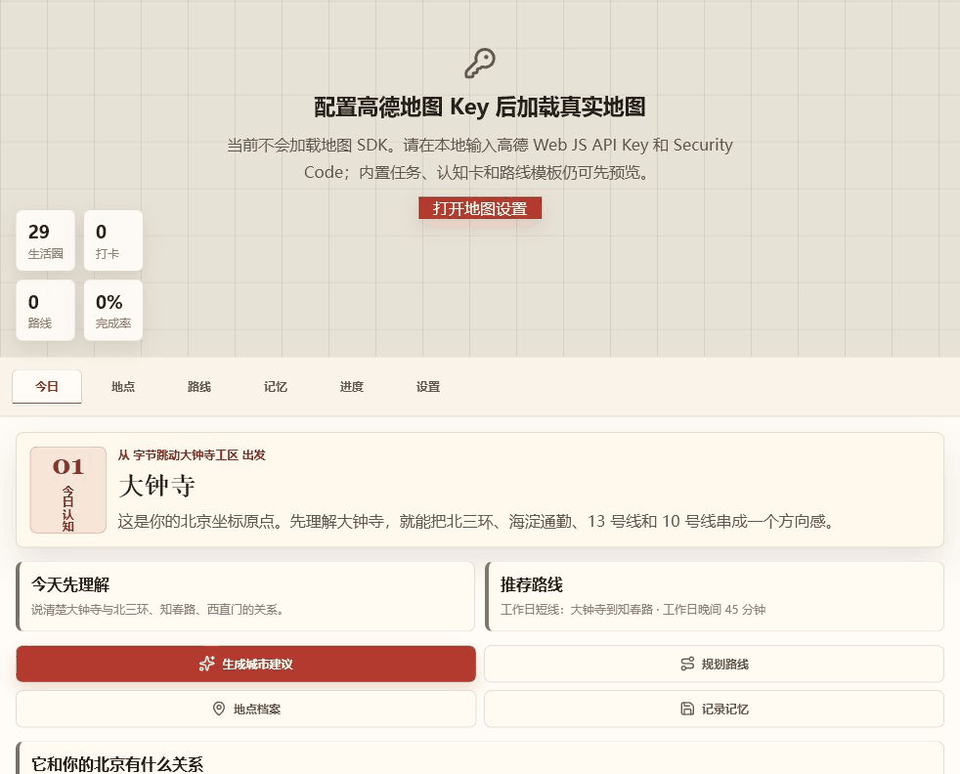

# 🗺️ Beijing Memory Map

一个本地优先的北京城市认知工作台。它把真实地图、地点档案、路线学习、记忆打卡和 AI 城市建议收敛到一个闭环里，帮助刚到北京的人从“我在哪”逐步建立可用的城市方向感。


## 🎬 项目演示



## ✨ 当前实现

- **今日认知**：聚焦一个地点、一个任务、一条推荐路线，降低新人理解北京的第一步成本。
- **地点档案**：解释地点为什么值得认识、和工作锚点的关系、适合什么时候去、下一步行动。
- **路线学习**：从当前工作锚点创建路线，模板路线可快速生成并在地图上高亮。
- **记忆打卡**：支持地图选点、地点记录、笔记和图片路径沉淀。
- **进度反馈**：按海淀短线、老城中轴、朝阳社交、南城更新、远郊周末等方向提示缺口。
- **本机设置**：支持配置工作锚点、高德地图 Key、AI Base URL / Model / API Key。

## 🎨 视觉方向

界面采用「城市档案 + 纸本地图 + 路牌标识」的设计语言：暖灰纸色底、朱红主按钮、细边框档案卡片和克制的状态标签。重点不是做一个泛 SaaS 面板，而是像一张正在被标注的北京城市工作图。

## 🛠️ 技术栈

- **前端框架**：React 19 + TypeScript
- **桌面应用**：Electron 39
- **构建工具**：Vite 7
- **状态管理**：Zustand
- **地图服务**：高德地图 JS API
- **本地数据**：sql.js + 本地设置存储
- **包管理**：npm workspaces

## 🚀 快速开始

### 环境要求

- Node.js 18+
- npm 9+

### 安装依赖

```bash
npm install
```

### 开发模式

```bash
npm run dev
```

开发服务默认使用 `http://127.0.0.1:5173/`。未配置高德 Key 时，地图区域会显示配置引导，但右侧核心流程仍可预览。

### 构建与检查

```bash
npm run typecheck
npm run build
```

## ⚙️ 本机配置

在应用右侧「设置」中配置：

- **工作锚点**：决定地图默认中心、路线起点和 AI 建议上下文。
- **高德地图**：填写 Web JS API Key 与 Security Code 后加载真实地图。
- **AI 城市建议**：填写 Base URL、Model 与 API Key 后生成俏皮但不幼稚的北京探索建议。

## 📁 项目结构

```text
beijing-memory-map/
├── apps/
│   └── desktop/          # Electron + React 桌面应用
│       ├── src/
│       │   ├── main/     # Electron 主进程与本地数据库
│       │   ├── preload/  # 预加载脚本
│       │   ├── renderer/ # 渲染进程与前端界面
│       │   └── shared/   # IPC 类型
├── assets/               # README 演示图与设计素材
├── docs/
│   └── prd/              # 产品需求文档
├── packages/
│   └── core/             # 核心类型
└── package.json
```

## 📖 核心文档

- [PRD v0.1](docs/prd/PRD-v0.1.md)
- [PRD v0.2](docs/prd/PRD-v0.2.md)
- [PRD v0.3](docs/prd/PRD-v0.3.md)

## 🧭 当前阶段

当前版本聚焦 PRD v0.3 的核心闭环：`今日认知 -> 地点档案 -> 路线/记忆 -> 进度反馈`。后续可继续推进动态 POI 搜索、路线质量、锚点驱动的任务模板生成和更完整的 AI 规划能力。
